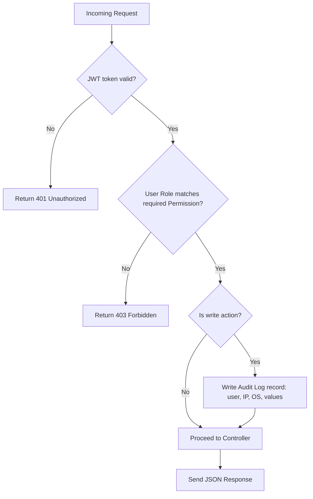
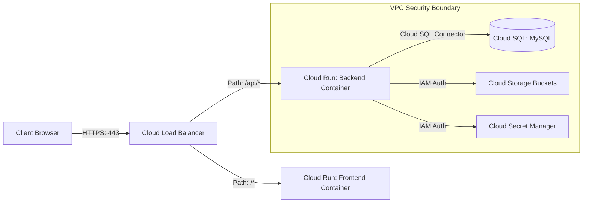

# Architecture & Flow Diagrams

This document contains Mermaid diagrams illustrating the CRDMS systems architecture, authentication flow, authorization middleware, and entity relations.

---

## 1. Authentication Lifecycle (JWT Rotation)

This diagram details the auth token rotation mechanism. Access tokens are short-lived, while refresh tokens are secure `httpOnly` cookies.

```mermaid
sequenceDiagram
    autonumber
    actor User as Client Browser
    participant API as Express API Server
    database DB as MySQL Database

    User->>API: POST /auth/login { username, password }
    API->>DB: Query user & verify password hash
    DB-->>API: User details (valid password)
    API->>API: Generate Access Token (15m expiry)<br/>Generate Refresh Token (7d expiry)
    API->>DB: Save Refresh Token hash to User record
    API-->>User: Set Refresh Token in secure httpOnly cookie,<br/>Return Access Token in JSON response body
    
    Note over User, API: Standard API requests use Access Token in Authorization Header

    User->>API: GET /candidates (with Access Token)
    API->>API: Token expired check?
    API-->>User: Return 401 Unauthorized (Expired Access Token)
    
    Note over User, API: Client interceptor catches 401 & triggers auto-refresh

    User->>API: POST /auth/refresh (includes httpOnly cookie)
    API->>DB: Match Refresh Token with Database record
    DB-->>API: Match successful & not expired
    API->>API: Generate New Access Token (15m expiry)
    API-->>User: Return New Access Token in JSON response body
    User->>API: Retry GET /candidates (with New Access Token)
    API-->>User: Return Candidate Data (200 OK)
```

---

## 2. Request Authorization Flow (RBAC Middleware)

This diagram demonstrates how incoming requests are authenticated and authorized by role permissions before reaching the resource controller.



---

## 3. Deployment Architecture Model

This diagram illustrates the cloud infrastructure and connectivity boundaries when deployed on Google Cloud Platform.


