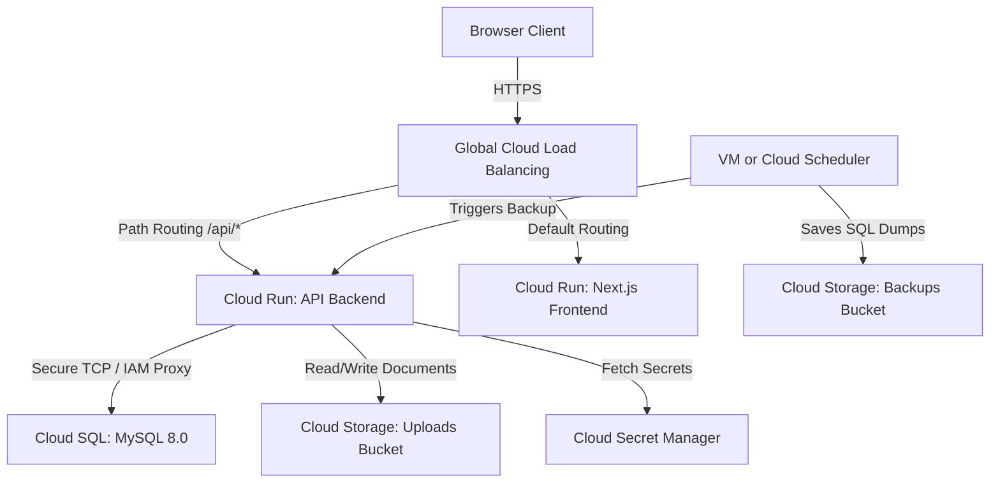

# Google Cloud Platform (GCP) Deployment Manual

This guide describes the complete instructions to deploy the **Candidate Records Database Management System (CRDMS)** in a highly secure, available, and scalable production architecture on Google Cloud Platform.

---

## Architecture Overview

For a resilient, production-ready GCP setup, the system is designed to map to the following managed services:



---

## 1. Google Cloud Storage (GCS) Setup

Two GCS buckets must be created:
1. **Document Uploads Bucket**: Stores resumes, certificates, and offer letters.
2. **Database Backups Bucket**: Stores daily compressed SQL backups.

### Step 1: Create Buckets
Run the following Google Cloud SDK commands to provision the buckets:
```bash
# Set environment variables
PROJECT_ID="your-gcp-project-id"
REGION="us-central1"

# Create uploads bucket (Standard storage, Uniform access control)
gcloud storage buckets create gs://${PROJECT_ID}-crdms-uploads \
  --project=${PROJECT_ID} \
  --location=${REGION} \
  --uniform-bucket-level-access

# Create backups bucket (Nearline/Coldline storage for cost efficiency)
gcloud storage buckets create gs://${PROJECT_ID}-crdms-backups \
  --project=${PROJECT_ID} \
  --location=${REGION} \
  --uniform-bucket-level-access
```

### Step 2: Configure CORS for Uploads
Save the following as `cors-json.json`:
```json
[
  {
    "origin": ["https://your-domain.com"],
    "method": ["GET", "POST", "PUT", "DELETE"],
    "responseHeader": ["Content-Type", "Authorization", "x-goog-meta-hash"],
    "maxAgeSeconds": 3600
  }
]
```
Apply the CORS settings:
```bash
gcloud storage buckets update gs://${PROJECT_ID}-crdms-uploads --cors-file=cors-json.json
```

---

## 2. Google Cloud SQL (MySQL 8.0) Setup

### Step 1: Provision Cloud SQL Instance
Create a Cloud SQL instance running MySQL 8.0 with automated daily backups and point-in-time recovery enabled.
```bash
gcloud sql instances create crdms-mysql-prod \
  --database-version=MYSQL_8_0 \
  --tier=db-custom-2-3840 \
  --region=${REGION} \
  --storage-type=SSD \
  --storage-size=20 \
  --enable-bin-log \
  --availability-type=regional \
  --root-password="StrongRootPassword123!"
```

### Step 2: Create Databases & Users
Create the database and the backend app user.
```bash
# Create database
gcloud sql databases create crdms --instance=crdms-mysql-prod

# Create application user
gcloud sql users create crdms_app_user \
  --instance=crdms-mysql-prod \
  --password="SecureAppUserPassword456!"
```

---

## 3. Secret Manager Configuration

Store sensitive credentials in Google Cloud Secret Manager to prevent exposure in logs or code repositories.

### Step 1: Register Secrets
Register the database credentials, mail transporter parameters, and JWT keys:
```bash
# DB Credentials
echo -n "SecureAppUserPassword456!" | gcloud secrets create CRDMS_DB_PASSWORD --data-file=-
echo -n "StrongRootPassword123!" | gcloud secrets create CRDMS_DB_ROOT_PASSWORD --data-file=-

# JWT Keys
echo -n "generate-a-secure-32-byte-hex-key-here" | gcloud secrets create CRDMS_JWT_SECRET --data-file=-
echo -n "generate-another-secure-32-byte-hex-key-here" | gcloud secrets create CRDMS_JWT_REFRESH_SECRET --data-file=-

# SMTP Credentials
echo -n "smtp-username-here" | gcloud secrets create CRDMS_MAIL_USERNAME --data-file=-
echo -n "smtp-password-here" | gcloud secrets create CRDMS_MAIL_PASSWORD --data-file=-
```

---

## 4. Building and Deploying Docker Containers

### Step 1: Configure Artifact Registry
Create a secure Docker registry in your GCP region.
```bash
gcloud artifacts repositories create crdms-docker-repo \
  --repository-format=docker \
  --location=${REGION} \
  --description="CRDMS Production Docker Registry"
```

### Step 2: Build and Tag Images
Build the frontend and backend containers using the multi-stage `Dockerfile`.
```bash
# Configure local docker to authenticate against GCP registry
gcloud auth configure-docker ${REGION}-docker.pkg.dev

# Build Backend Image
docker build \
  --target backend \
  -t ${REGION}-docker.pkg.dev/${PROJECT_ID}/crdms-docker-repo/backend:latest \
  -f deployment/Dockerfile .

# Build Frontend Image (Define API url for next build step)
docker build \
  --target frontend \
  --build-arg NEXT_PUBLIC_API_URL=https://api.your-domain.com/api \
  -t ${REGION}-docker.pkg.dev/${PROJECT_ID}/crdms-docker-repo/frontend:latest \
  -f deployment/Dockerfile .
```

### Step 3: Push Images to Artifact Registry
```bash
docker push ${REGION}-docker.pkg.dev/${PROJECT_ID}/crdms-docker-repo/backend:latest
docker push ${REGION}-docker.pkg.dev/${PROJECT_ID}/crdms-docker-repo/frontend:latest
```

---

## 5. Deploying to Google Cloud Run

Deploy the services and link them directly to Cloud SQL and Cloud Secret Manager.

### Step 1: Deploy Backend Container
```bash
gcloud run deploy crdms-backend \
  --image=${REGION}-docker.pkg.dev/${PROJECT_ID}/crdms-docker-repo/backend:latest \
  --region=${REGION} \
  --platform=managed \
  --allow-unauthenticated \
  --port=5000 \
  --add-cloudsql-instances=${PROJECT_ID}:${REGION}:crdms-mysql-prod \
  --update-env-vars=NODE_ENV=production,DB_HOST=127.0.0.1,DB_USER=crdms_app_user,DB_NAME=crdms,DB_PORT=3306,GCS_BUCKET_NAME=${PROJECT_ID}-crdms-uploads,GCP_PROJECT_ID=${PROJECT_ID},MAIL_HOST=smtp.gmail.com,MAIL_PORT=587,MAIL_SECURE=false,MAIL_FROM_NAME=CRDMS,MAIL_FROM_EMAIL=no-reply@your-domain.com \
  --update-secrets=DB_PASSWORD=CRDMS_DB_PASSWORD:latest,JWT_SECRET=CRDMS_JWT_SECRET:latest,JWT_REFRESH_SECRET=CRDMS_JWT_REFRESH_SECRET:latest,MAIL_USERNAME=CRDMS_MAIL_USERNAME:latest,MAIL_PASSWORD=CRDMS_MAIL_PASSWORD:latest
```

### Step 2: Deploy Frontend Container
```bash
gcloud run deploy crdms-frontend \
  --image=${REGION}-docker.pkg.dev/${PROJECT_ID}/crdms-docker-repo/frontend:latest \
  --region=${REGION} \
  --platform=managed \
  --allow-unauthenticated \
  --port=3000 \
  --update-env-vars=NODE_ENV=production,NEXT_PUBLIC_API_URL=https://api.your-domain.com/api
```

---

## 6. Nginx & Domain Routing (Cloud Load Balancing)

To map a single domain (`your-domain.com` and `api.your-domain.com`) to the services, configure **Google Cloud HTTP(S) Load Balancing** with Serverless Network Endpoint Groups (NEGs):

1. Create a serverless NEG for `crdms-frontend` and `crdms-backend`.
2. Configure a URL map routing path `/api/*` to the backend NEG, and default `/*` path to the frontend NEG.
3. Configure Google-managed SSL Certificates for HTTP-to-HTTPS redirect.

*Alternatively, if running on virtual machines (GCE Instance Group)*:
Copy `deployment/nginx.conf` directly to `/etc/nginx/nginx.conf` and mount certificates into `/etc/nginx/ssl`.

---

## 7. Database Backups Configuration

Automatic backups utilize the Node.js script located in `deployment/backup.js`. It runs a MySQL dump, compresses it to gzip, and streams it to the Nearline GCS backups bucket.

### Setup using a GCP VM Cron Job:
1. Provision a lightweight micro-VM in the same VPC.
2. Grant the VM's service account the **Storage Object Creator** and **Storage Object Viewer** IAM permissions on the backups bucket.
3. Configure the VM's crontab using `deployment/cron.example`:
   ```bash
   # Open crontab editor
   crontab -e
   ```
   Add the following line (to execute every night at 2:00 AM):
   ```cron
   0 2 * * * cd /path/to/deployment && ./backup.sh >> /var/log/crdms-backup.log 2>&1
   ```
